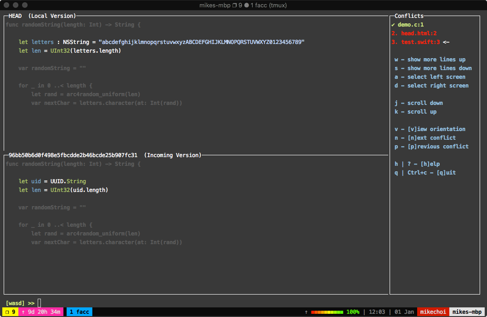

<p align="center">
     
<p align="center">
    Easy-to-use CUI for fixing git conflicts
    <br>
    <br>
  </p>
</p>
<br>

I never really liked any of the `mergetools` out there so I made a simple program that does simple things… in a simple fashion.



## 👷 Installation

Execute:

```bash
$ go get github.com/mkchoi212/fac
```

Or using [Homebrew 🍺](https://brew.sh)

```bash
brew tap mkchoi212/fac https://github.com/mkchoi212/fac.git
brew install fac
```

## 🔧 Using

> **Please note fac does NOT support diff3 merge conflict outputs yet!**

`fac` operates much like `git add -p` . It has a prompt input at the bottom of the screen where the user inputs various commands.

The commands have been preset to the following specifications

```
w - show more lines up
s - show more lines down
a - use local version
d - use incoming version

j - scroll down
k - scroll up

v - [v]iew orientation
n - [n]ext conflict
p - [p]revious conflict

h | ? - [h]elp
q | Ctrl+c - [q]uit

[w,a,s,d,?] >> [INPUT HERE]
```

> The movement controls have been derived from both the world of gamers (WASD) and VIM users (HJKL).

## ✋ Contributing

This is an open source project so feel free to contribute by

- Opening an [issue](https://github.com/mkchoi212/fac/issues/new)
- Sending me feedback via [email](mailto://mkchoi212@icloud.com)
- Or [tweet](https://twitter.com/Bananamlkshake2) at me!

## 👮 License
See [License](./LICENSE)
